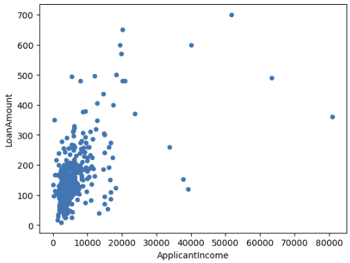
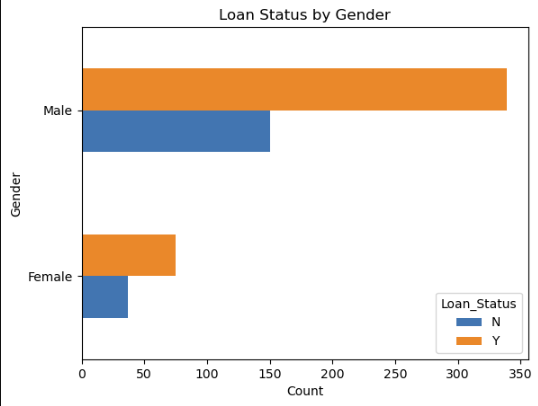
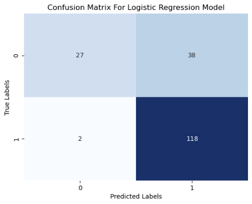
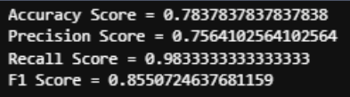
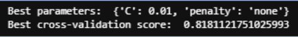

# Loan Predictions & Deployment Project

### [Assignment](assignment.md)

## Project/Goals 🎯
The goal of this project is to build a loan predictor api that is stired in the cloud to handle predicitons on whether a loan will be approved or rejected based on a set of input features such as gender, marital status, credit history, etc. The application uses a machine learning model to make the prediction along with a pipeline. This provide a useful tool for individuals or organizations who need to evaluate loan applications. By automating the loan prediction process, the application can save time and resources and make the loan process more efficient.

## Hypothesis 💭
Generating a hypothesis is a major step in the process of analyzing data. This involves understanding the problem and formulating a meaningful hypothesis about what could potentially have a good impact on the outcome.

Which applicants are more likely to get a loan:

1. Applicants having a credit history
2. Applicants with higher applicant and co-applicant incomes
3. Applicants with higher education level
4. Properties in urban areas with high growth perspectives

## EDA 🔎
I firstly noticed how the applicant and co-applicant data was not completely normally distributed. This was altered through a log transformation to normalize the data. Missing values for categorical variables were imputed with the mode, and numerical columns were imputed with the median since we have outliers. Applicant and co-applicant income were joined to create a new feature 'Total_Income'. The data set was vaised towards males but when looking at gender in terms of approved and non-approved it was quite similar.

## Process 🔄️
1. Hypothesis Generation (Who is most likely to get a loan?)

2. EDA (Clean & Wrangle)

3. Building a Predictive Model 

4. Creating a Pipeline

5. Deploying Model 

## Results/Demo 📊

- The baseline logistic regression model has an accuracy score of 0.78 meaning the model was able to predict 78% of the loan applications 

- The recall score is also quite high at 98%

- However doing grid search and tuning the hyperparameters I was able to get a score of 0.81 or 81% which is a little bit better

- The API was able to successfully post to the webpage and load from the 'app.py' code. This file loads the model from the pickle file and then accepts a json post request which runs the model and gives back a prediction. (Seen at the bottom of the instuctions.ipynb notebook)

## Challanges 🚧
One challenge I had was getting my API working so that it could display the loan predictions onto the webpage while having it run on the cloud at all times. 

## Future Goals 💡
 I would like to try out more classification models in the future to see if I can get better prediction results. 
